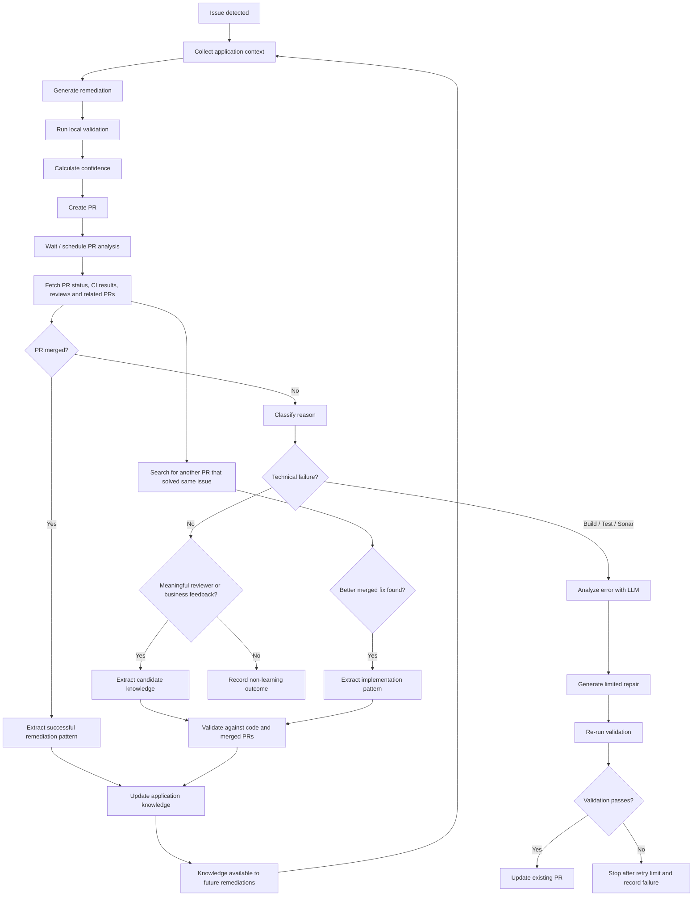
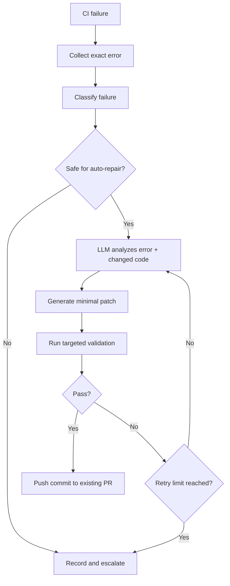
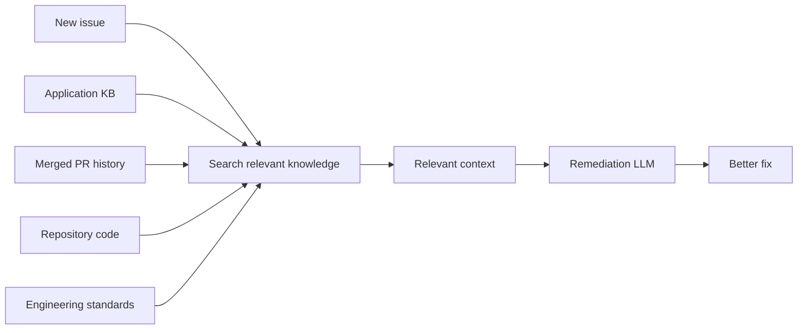
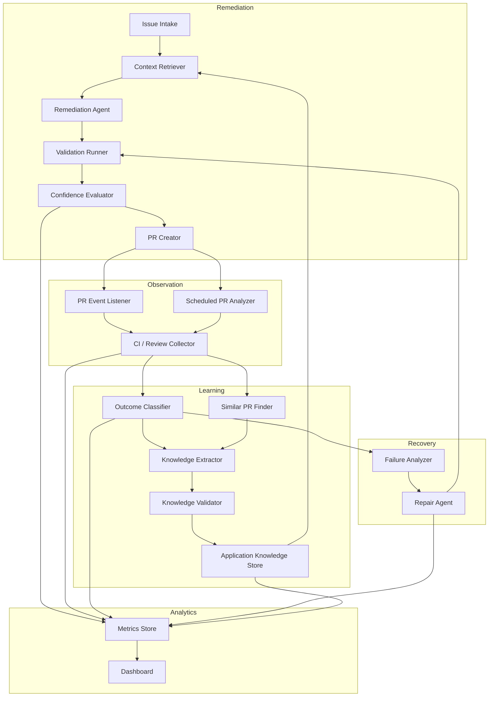
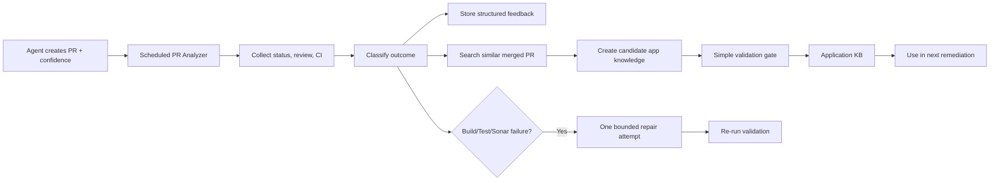
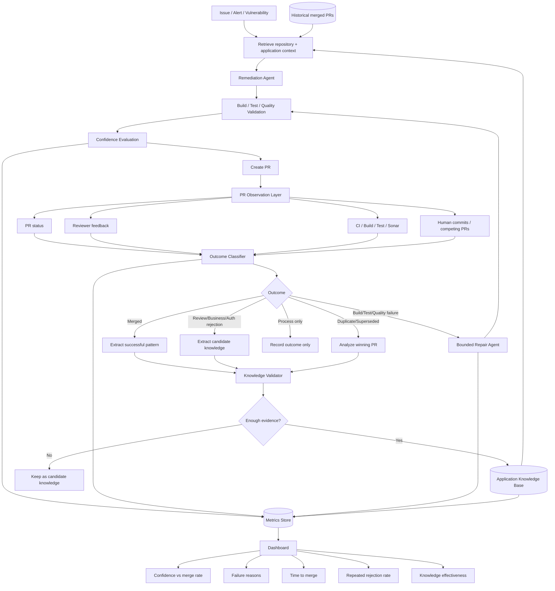

# Auto-Remediation Agent: Feedback, Learning, and PR Recovery Architecture

## 1. Purpose

The current auto-remediation agent can identify issues, generate code changes, and create pull requests (PRs). However, a low PR merge rate means that creating a technically plausible fix is not enough.

Typical reasons for rejection include:

- The agent does not understand application-specific authentication or authorization patterns.
- The agent misses business or domain context.
- The generated code does not follow patterns already used by the application team.
- The build fails.
- Tests fail.
- Sonar or other quality gates fail.
- Reviewers reject the PR for a meaningful technical reason.
- Another PR fixes the same issue in a better way.

The architecture proposed here adds a **post-PR analysis and learning loop**.

The goal is not only to fix failed PRs. The larger goal is to make every PR an opportunity to improve the next remediation.

---

## 2. Core Idea

The system has two loops:

1. **Remediation loop** — Analyses an issue, creates a fix, validates it, assigns confidence, and creates a PR.
2. **Learning loop** — revisits the PR after some time, checks what happened, learns from feedback and successful fixes, and optionally repairs technical failures.



---

# 3. What Each Step Solves

## Step 1 — Collect Application Context

### Problem it solves

A generic coding model may know how authentication, retries, exception handling, logging, or validation usually work, but it may not know how **this application** expects them to work.

For example:

- The organization may require a common `AuthClient`.
- A service may require a specific validation library.
- Certain APIs may only be called through an internal wrapper.
- A business rule may not be visible from the failing line of code.
- A team may intentionally avoid a common coding pattern.

Without this context, the agent can produce code that is technically reasonable but still unacceptable to the application team.

### What the system should collect

Before generating a fix, retrieve:

- repository-level coding guidance,
- application-specific knowledge,
- similar files,
- similar historical fixes,
- previous merged PRs,
- previous rejected PR feedback,
- authentication patterns,
- testing patterns,
- error-handling patterns,
- business rules that are relevant to the affected component.

### Possible implementation

Create an **Application Knowledge Store**.

Example knowledge record:

```json
{
  "application": "payments-service",
  "category": "authentication",
  "knowledge": "Use InternalAuthClient for service-to-service authentication.",
  "evidence": [
    "PR-1742",
    "PR-1821",
    "src/security/PaymentAuthConfig.java"
  ],
  "confidence": 0.96,
  "status": "validated"
}
```

Retrieve the most relevant records before remediation and include them in the LLM context.

This can be implemented using:

- vector search / RAG,
- metadata filters by application and component,
- code search,
- historical PR search,
- or a combination of them.

---

# 4. Generate the Remediation

### Problem it solves

This is the existing responsibility of the remediation agent: produce a code change that addresses the detected issue.

### Improvement

The fix should not be generated only from the incident or error.

The prompt should include:

1. the detected problem,
2. relevant source code,
3. application knowledge,
4. similar merged changes,
5. applicable engineering policies,
6. validation requirements.

### Suggested output

The agent should return structured information along with the code change.

Example:

```json
{
  "root_cause": "Null value reaches downstream payment mapper",
  "proposed_fix": "Validate customer payment profile before mapping",
  "files_changed": [
    "PaymentService.java",
    "PaymentServiceTest.java"
  ],
  "assumptions": [
    "PaymentValidator is the approved validation abstraction"
  ],
  "risks": [
    "May affect legacy clients that rely on current null handling"
  ]
}
```

This structured output is useful later when the PR is analyzed.

---

# 5. Run Local Validation Before Creating the PR

### Problem it solves

Some PRs are rejected for problems the system could have detected before involving humans.

Examples:

- code does not compile,
- unit tests fail,
- lint fails,
- Sonar issues are introduced,
- formatter checks fail,
- generated code references unavailable libraries.

### Implementation

Before PR creation, run the same checks that the repository normally runs.

Typical checks:

```text
Compile
  ↓
Unit tests
  ↓
Targeted integration tests
  ↓
Lint / formatting
  ↓
Static analysis
  ↓
Security checks
```

The exact checks should be repository-specific.

A Java repository may run Maven or Gradle.

A JavaScript repository may run npm test, ESLint, and TypeScript compilation.

The agent should only create a PR after the minimum required checks pass, unless the system explicitly supports creating a known-partial PR.

---

# 6. Calculate Confidence Before PR Creation

### Problem it solves

Today, all generated PRs may appear equally trustworthy even when the agent has very different levels of understanding.

A confidence score lets us answer an important question:

> When the agent says it is confident, is it actually more likely that the PR will be accepted?

### Do not use only one opaque score

Prefer a decomposed score.

Example:

| Confidence dimension | Example score |
|---|---:|
| Root-cause understanding | 0.91 |
| Fix correctness | 0.84 |
| Application context | 0.52 |
| Authentication / authorization context | 0.40 |
| Test coverage | 0.82 |
| Similar historical pattern found | 0.88 |
| Overall confidence | 0.68 |

### Why this is useful

Suppose high-confidence PRs still fail.

The detailed score may reveal:

```text
Technical confidence       = High
Application context        = Low
Authentication context     = Low
```

That tells us the main problem is not code generation. It is context retrieval.

### Initial implementation

Start with an LLM-generated structured confidence assessment, but make the reasons explicit.

Later, calibrate the score using real PR outcomes.

For example:

| Confidence range | PR count | Merge rate |
|---|---:|---:|
| 0.0–0.2 | 80 | 8% |
| 0.2–0.4 | 120 | 17% |
| 0.4–0.6 | 210 | 31% |
| 0.6–0.8 | 300 | 54% |
| 0.8–1.0 | 190 | 78% |

If 0.8-confidence PRs only merge 40% of the time, the score is not well calibrated.

---

# 7. Create the PR and Store the Remediation Record

Every generated PR should have a corresponding internal remediation record.

Example:

```json
{
  "remediation_id": "REM-10421",
  "application": "payments-service",
  "issue_id": "SEC-4921",
  "pr_id": "PR-1942",
  "created_at": "2026-09-10T10:30:00Z",
  "root_cause": "...",
  "fix_summary": "...",
  "overall_confidence": 0.68,
  "context_confidence": 0.52,
  "auth_confidence": 0.40,
  "validation": {
    "build": "passed",
    "unit_tests": "passed",
    "sonar": "pending"
  }
}
```

This becomes the base record for later analysis.

---

# 8. Schedule a PR Analysis Loop

### Problem it solves

Once a PR is created, the existing agent may stop learning.

That loses valuable information.

The application team may explain exactly why the fix is wrong. CI may expose an issue. Another engineer may create the correct fix.

The system should come back later and inspect what happened.

### Trigger options

A simple V1 can run:

- 24 hours after PR creation,
- 48 hours after PR creation,
- and optionally when important PR events occur.

A more mature system can be event-driven.

Example events:

- CI failed,
- reviewer requested changes,
- PR merged,
- PR closed,
- new commit added,
- another linked PR merged.

### Recommended approach

Use both:

```text
Event-driven checks
+
Scheduled safety-net check
```

The scheduled check ensures no event is missed.

---

# 9. Fetch PR Outcome and Evidence

The analyzer should collect:

- PR state,
- merged / open / closed status,
- review comments,
- requested changes,
- CI checks,
- build errors,
- test failures,
- Sonar output,
- commits added by humans,
- code changes after the agent's original commit,
- linked issues,
- related PRs.

This is the evidence used by the learning loop.

---

# 10. First Decision: Was the PR Merged?

## If yes

Do not simply mark it as success.

Extract why it likely worked.

Possible successful signals:

- followed an existing code pattern,
- reused an internal framework,
- added the expected tests,
- made a minimal change,
- used the correct authentication mechanism,
- followed service-specific exception handling,
- avoided unnecessary architectural changes.

Example:

```json
{
  "application": "payments-service",
  "pattern_type": "successful_remediation",
  "problem_type": "null_validation",
  "pattern": "Validate through PaymentValidator before PaymentMapper invocation.",
  "evidence": [
    "PR-1942"
  ]
}
```

Over time, successful patterns become very valuable retrieval context.

---

# 11. If Not Merged, Classify the Reason

### Problem it solves

"PR not merged" is too broad to be useful.

A failed build and a business-rule rejection are completely different problems.

The system should classify the reason.

### Suggested taxonomy

| Category | Examples | Action |
|---|---|---|
| Build failure | compile error, missing dependency | attempt repair |
| Test failure | unit/integration test failure | attempt repair |
| Quality failure | Sonar, lint, coverage | attempt repair |
| Security failure | scanner or policy violation | repair or escalate |
| Code review | wrong implementation, edge case missed | learn pattern |
| Application context | wrong internal framework or convention | learn app knowledge |
| Authentication | incorrect auth flow or token handling | learn auth pattern |
| Business context | fix violates domain behavior | learn business rule |
| Duplicate / superseded | another PR already fixed it | inspect winning PR |
| Process reason | freeze, priority change, cancelled issue | record only |
| Unknown | insufficient evidence | retain for analysis |

The classification can initially be performed by an LLM over the PR comments and CI results.

The output should be structured, not free text.

Example:

```json
{
  "primary_reason": "application_context",
  "secondary_reason": "authentication",
  "meaningful_feedback": true,
  "confidence": 0.93,
  "evidence": [
    "Reviewer: Use the platform AuthClient instead of generating OAuth tokens directly."
  ]
}
```

---

# 12. Technical Failure Auto-Repair Loop

### Problem it solves

Some PRs are rejected because the agent made a mechanical error that can be corrected automatically.

Examples:

- compilation failure,
- missing import,
- failing unit test,
- formatting issue,
- Sonar violation,
- type mismatch.

These failures should not always require human intervention.

### Flow



### Important guardrails

Do not create an unlimited self-repair loop.

Recommended V1:

- maximum 1–3 repair attempts,
- only modify files relevant to the existing remediation,
- do not introduce broad refactors,
- rerun targeted tests after every patch,
- keep a full record of every attempt,
- stop if the type of failure changes unexpectedly.

### Example

```text
Initial PR
    ↓
Compilation fails
    ↓
Agent identifies wrong method signature
    ↓
Patch #1
    ↓
Compilation passes
    ↓
Unit test fails
    ↓
Patch #2
    ↓
All validation passes
    ↓
Update PR
```

---

# 13. Extract Meaningful Reviewer Feedback

### Problem it solves

Reviewer comments are one of the highest-value sources of application knowledge.

Example comment:

> Do not create OAuth tokens directly. All service-to-service calls from this application must use PlatformAuthClient.

The system should not treat this as merely a comment on one PR.

It may represent reusable application knowledge.

### Convert feedback into candidate knowledge

Example:

```json
{
  "application": "payments-service",
  "category": "authentication",
  "candidate_knowledge": "Service-to-service authentication should use PlatformAuthClient rather than direct OAuth token generation.",
  "source": "PR-1942 reviewer comment",
  "candidate_confidence": 0.78
}
```

The keyword here is **candidate**.

Do not immediately make every reviewer comment permanent knowledge.

---

# 14. Validate Knowledge Before Adding It to RAG

### Problem it solves

Blindly placing every comment into RAG can create bad or contradictory knowledge.

A reviewer may be:

- commenting on a special case,
- expressing a preference,
- giving outdated guidance,
- making a statement that applies only to one module.

### Validation strategy

Check candidate knowledge against other evidence.

Possible evidence:

1. Existing source code.
2. Multiple merged PRs.
3. Repository documentation.
4. Team standards.
5. Repeated reviewer comments.
6. Code owners' comments.
7. Recent commits.

Example:

```text
Candidate rule:
"Use PlatformAuthClient"

Evidence:
PR-1942 reviewer comment           ✓
PR-1811 merged change              ✓
PR-1760 merged change              ✓
Current auth configuration         ✓

Result:
Validated, confidence 0.96
```

### Knowledge states

Use lifecycle states:

```text
Candidate
   ↓
Validated
   ↓
Active
   ↓
Deprecated / Replaced
```

This avoids treating the knowledge store as an uncurated text dump.

---

# 15. Search for Another PR That Fixed the Same Issue

### Problem it solves

The strongest lesson may not come from the rejected PR.

Another developer may later create the correct fix.

Example:

```text
Agent PR #1942
Rejected

Developer PR #1965
Merged
```

The system should compare them.

### Search criteria

Look for:

- same issue or ticket,
- same vulnerability ID,
- same failing file,
- same stack trace,
- same code owner,
- same error fingerprint,
- similar code change,
- same service and issue type.

### What to compare

```text
Agent PR
vs.
Merged PR
```

Compare:

- files modified,
- API/library choices,
- authentication approach,
- validation logic,
- tests added,
- exception handling,
- amount of change,
- architectural pattern.

### Example learning

```text
Agent fix:
Generated OAuth token manually.

Merged fix:
Used PlatformAuthClient.

Reusable knowledge:
payments-service must use PlatformAuthClient for
service-to-service authentication.
```

This creates a particularly strong learning signal because the system sees both the failed and successful approaches.

---

# 16. Application Knowledge Store

The learning loop should produce structured, application-specific knowledge.

A useful mental model is:

```text
Generic LLM knowledge
       +
Company engineering standards
       +
Repository knowledge
       +
Application-specific learned patterns
       +
Issue-specific context
       =
Better remediation
```

### Suggested knowledge categories

- Authentication
- Authorization
- Business rules
- API usage
- Database access
- Error handling
- Logging
- Validation
- Testing
- Internal libraries
- Configuration
- Deployment
- Security conventions
- Code style
- Common successful remediation patterns
- Known anti-patterns

### Example record

```json
{
  "knowledge_id": "KN-8492",
  "application": "customer-service",
  "component": "CustomerProfile",
  "category": "validation",
  "statement": "Customer profile validation must be performed using CustomerValidator before downstream API calls.",
  "evidence": [
    {
      "type": "merged_pr",
      "id": "PR-1087"
    },
    {
      "type": "merged_pr",
      "id": "PR-1142"
    },
    {
      "type": "review_comment",
      "id": "PR-1198"
    }
  ],
  "confidence": 0.94,
  "status": "active",
  "last_verified_at": "2026-09-10"
}
```

---

# 17. How RAG Fits Into the Architecture

RAG means the system retrieves useful information before asking the LLM to generate an answer or code change.

The important point is:

> RAG is not the learning mechanism by itself. It is the delivery mechanism that gives previously learned knowledge back to the remediation agent.

The learning loop creates and validates knowledge.

RAG makes that knowledge available during future remediation.

### Simplified flow



### Retrieval should be filtered

Do not retrieve globally similar text without context.

Prefer filters such as:

```text
application = payments-service
component = authentication
language = Java
issue_type = authorization_failure
knowledge_status = active
```

Then use semantic similarity within that filtered set.

---

# 18. Confidence and Merge-Rate Analytics

One of the most useful additions is to capture confidence during the first remediation attempt and compare it with actual PR outcomes.

### Primary metric

```text
Confidence bucket → merge rate
```

Example:

| Agent confidence | Merge rate |
|---|---:|
| 0.0–0.2 | 8% |
| 0.2–0.4 | 17% |
| 0.4–0.6 | 31% |
| 0.6–0.8 | 54% |
| 0.8–1.0 | 78% |

This tells us whether confidence has predictive value.

### More useful analysis

Also measure:

```text
Confidence
    ×
Application
    ×
Issue type
    ×
Failure reason
```

For example:

```text
Application: payment-service
Issue: authentication
Average confidence: 0.84
Merge rate: 0.38

Rejected PR reasons:
70% incorrect app-specific auth pattern
20% tests
10% other
```

This tells us exactly what capability should improve.

---

# 19. Other Important Metrics

Merge rate should remain important, but it should not be the only metric.

Track:

| Metric | Why it matters |
|---|---|
| PR merge rate | Overall success |
| Merge rate by confidence | Measures confidence usefulness |
| Median time to merge | Measures speed |
| Human review iterations | Measures reviewer effort |
| Agent repair iterations | Measures self-correction |
| Build-pass-at-first-attempt | Measures technical quality |
| Test-pass-at-first-attempt | Measures technical quality |
| Reviewer rejection category | Identifies missing capabilities |
| Knowledge reused successfully | Measures learning value |
| Repeat rejection rate | Shows whether the system learns |
| Application-context failure rate | Shows RAG/context quality |
| False-high-confidence rate | Measures overconfidence |

### Particularly valuable metric

Track whether the **same rejection reason happens again after it has been learned**.

Example:

```text
Before learning:
14 PRs rejected for incorrect AuthClient usage

Knowledge added:
"Use PlatformAuthClient"

After learning:
2 similar PRs rejected for the same reason
```

This directly measures whether the learning loop works.

---

# 20. Recommended System Components

A practical implementation can be split into the following services.



---

# 21. Component Responsibilities

## 21.1 Context Retriever

Retrieves information required before generating the remediation.

Sources may include:

- repository code,
- application KB,
- architecture docs,
- historical PRs,
- coding standards,
- prior reviewer feedback.

Output:

```json
{
  "relevant_code": [],
  "application_rules": [],
  "similar_fixes": [],
  "risk_context": []
}
```

---

## 21.2 Remediation Agent

Produces the proposed change.

It should also document:

- root cause,
- assumptions,
- risks,
- files changed,
- why the fix should work.

---

## 21.3 Validation Runner

Runs deterministic tools such as:

- compiler,
- tests,
- linter,
- static analysis,
- Sonar,
- policy checks.

This should be treated as the source of truth for technical validation rather than asking an LLM whether code "looks correct."

---

## 21.4 Confidence Evaluator

Produces the confidence dimensions.

Possible inputs:

- whether similar merged examples exist,
- amount of relevant application knowledge retrieved,
- validation status,
- ambiguity of root cause,
- scope of the code change,
- test coverage,
- LLM self-assessment.

Later, historical data can be used to calibrate or replace parts of this scoring logic.

---

## 21.5 PR Analyzer

Runs after PR creation.

It gathers:

- state,
- reviews,
- CI,
- human modifications,
- related PRs,
- final outcome.

---

## 21.6 Outcome Classifier

Turns unstructured PR evidence into a normalized outcome.

Example output:

```json
{
  "outcome": "not_merged",
  "reason": "application_context",
  "sub_reason": "authentication",
  "meaningful_feedback": true,
  "learning_value": "high"
}
```

---

## 21.7 Similar PR Finder

Searches historical PRs for successful implementations related to the same issue.

This component may combine:

- exact issue linkage,
- code search,
- embeddings,
- error fingerprints,
- changed-file similarity,
- application metadata.

---

## 21.8 Knowledge Extractor

Converts reviews and successful fixes into reusable candidate knowledge.

It should extract concise rules rather than store only long review discussions.

---

## 21.9 Knowledge Validator

Prevents low-quality information from becoming trusted application knowledge.

It should check:

- supporting evidence,
- conflicts,
- recency,
- scope,
- number and quality of sources.

---

## 21.10 Repair Agent

Handles failures that are suitable for automatic correction.

It receives:

```text
Original issue
+
Original patch
+
Exact CI error
+
Relevant code
+
Application knowledge
```

It produces the smallest reasonable patch and sends it back through validation.

---

# 22. Data Model

A small number of well-defined records are enough for a first version.

## Remediation record

```json
{
  "remediation_id": "REM-1",
  "application": "payments-service",
  "issue_id": "ISSUE-10",
  "pr_id": "PR-20",
  "initial_confidence": 0.74,
  "context_confidence": 0.55,
  "created_at": "...",
  "status": "open"
}
```

## PR outcome record

```json
{
  "pr_id": "PR-20",
  "merged": false,
  "failure_category": "authentication",
  "meaningful_feedback": true,
  "ci_status": "passed",
  "review_status": "changes_requested"
}
```

## Repair attempt

```json
{
  "pr_id": "PR-20",
  "attempt": 1,
  "trigger": "unit_test_failure",
  "error": "...",
  "patch_summary": "...",
  "result": "passed"
}
```

## Knowledge record

```json
{
  "application": "payments-service",
  "category": "authentication",
  "statement": "...",
  "evidence": [],
  "confidence": 0.92,
  "status": "active"
}
```

---

# 23. Safety and Quality Guardrails

The learning loop should not automatically trust everything it observes.

Recommended controls:

1. **Retry limit** for automatic repair.
2. **Knowledge confidence threshold** before reuse.
3. **Evidence requirement** for strong application rules.
4. **Application-level scoping** so one team's rule does not leak into another application.
5. **Recency tracking** so outdated conventions can be replaced.
6. **Conflict detection** when two sources disagree.
7. **Audit trail** showing why a knowledge item exists.
8. **Human override** for critical rules.
9. **No broad refactor during repair** unless explicitly permitted.
10. **Deterministic validation** after every generated patch.

---

# 24. Suggested V1

Do not attempt the full architecture immediately.

A useful first version can be relatively small.



### V1 scope

Implement:

- confidence collection,
- PR status collection,
- reviewer feedback classification,
- CI failure classification,
- similar merged PR search,
- candidate knowledge extraction,
- basic RAG,
- one bounded repair attempt,
- dashboard for confidence vs merge rate.

This is already enough to test whether the concept improves merge rate.

---

# 25. Suggested V2

After V1 produces reliable data:

- move from scheduled polling to PR events,
- introduce better confidence calibration,
- add knowledge validation using multiple evidence sources,
- compare agent PR with later merged human PR,
- introduce application knowledge lifecycle,
- support multiple bounded repair iterations,
- measure knowledge effectiveness,
- detect stale or conflicting knowledge.

---

# 26. Example End-to-End Scenario

Consider an authentication-related issue.

## Initial attempt

The agent finds a vulnerable direct OAuth token generation flow.

It generates a fix that replaces the old logic with another direct token flow.

Confidence:

```text
Root cause:            0.93
Technical fix:         0.86
Application context:   0.48
Authentication context:0.42
Overall:               0.67
```

The PR builds successfully.

## Reviewer response

The application team comments:

> Service-to-service authentication must use PlatformAuthClient.

The PR is not merged.

## Learning loop

The analyzer classifies:

```text
Failure category: Application context
Sub-category: Authentication
Learning value: High
```

It searches merged PR history.

Two previous merged PRs also use `PlatformAuthClient`.

The system creates candidate knowledge:

```text
payments-service uses PlatformAuthClient for
service-to-service authentication.
```

Because the rule has multiple pieces of evidence, it becomes validated application knowledge.

## Next similar issue

A new authentication issue appears.

Before remediation, RAG retrieves:

```text
Application rule:
Use PlatformAuthClient for service-to-service authentication.
```

The agent generates a new fix using that pattern.

The PR passes tests and is merged.

This is the key behavior the architecture is trying to create:

```text
Failure
   ↓
Evidence
   ↓
Learning
   ↓
Reusable application knowledge
   ↓
Better next remediation
```

---

# 27. What Success Looks Like

The desired outcome is not that every PR is automatically merged.

The desired outcome is that the system becomes progressively better at producing application-appropriate fixes.

A healthy trend would look like:

```text
Higher PR merge rate
        +
Lower build/test failure rate
        +
Fewer review iterations
        +
Fewer repeated rejection reasons
        +
Better confidence calibration
        +
More reuse of validated application knowledge
        +
Lower time to merge
```

The strongest proof that the architecture works is:

> Once the agent learns a valid application-specific rule, future PRs should stop failing for the same reason.

---

# 28. Final Architecture in One View



---

# 29. Summary

The architecture changes the remediation system from a one-shot code generator into a feedback-driven engineering system.

The main responsibilities are:

| Step | Main problem solved |
|---|---|
| Retrieve application context | Agent does not understand the application |
| Validate before PR | Avoid obvious build/test failures |
| Capture confidence | Understand when the agent is likely to succeed |
| Analyze PR after creation | Learn what really happened |
| Classify rejection reason | Separate technical failure from context failure |
| Auto-repair CI failures | Recover from mechanical mistakes |
| Extract reviewer knowledge | Learn application-specific rules |
| Find successful related PRs | Learn the correct implementation pattern |
| Validate knowledge | Prevent bad information from polluting RAG |
| Feed knowledge back through RAG | Improve future remediation |
| Measure confidence vs merge rate | Quantify whether the agent knows when it is right |
| Track repeated failures | Verify that the system is actually learning |

The most important design principle is:

> **Every PR should produce a measurable outcome, and every meaningful outcome should improve either the remediation logic, the application knowledge, or the confidence model.**
